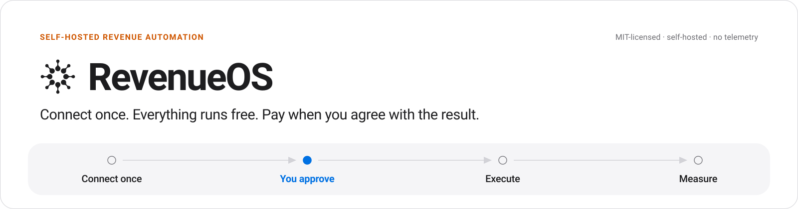
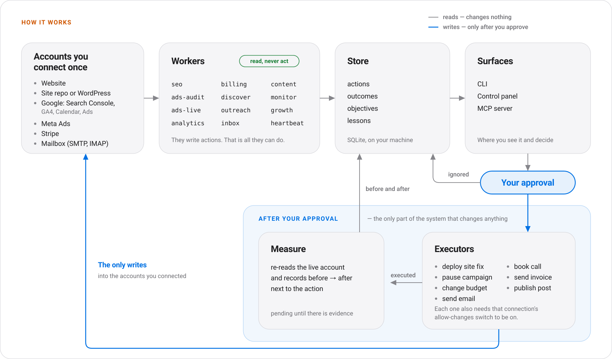
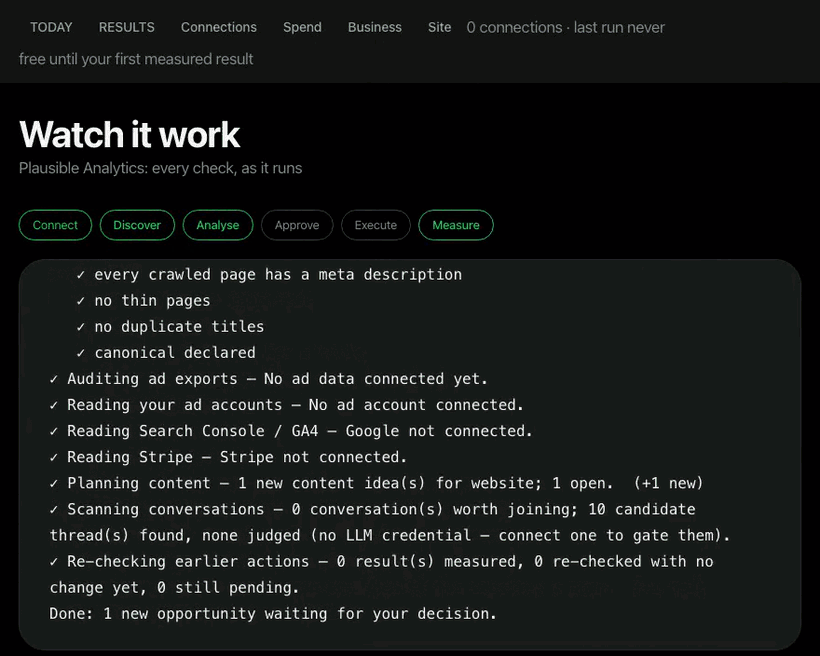
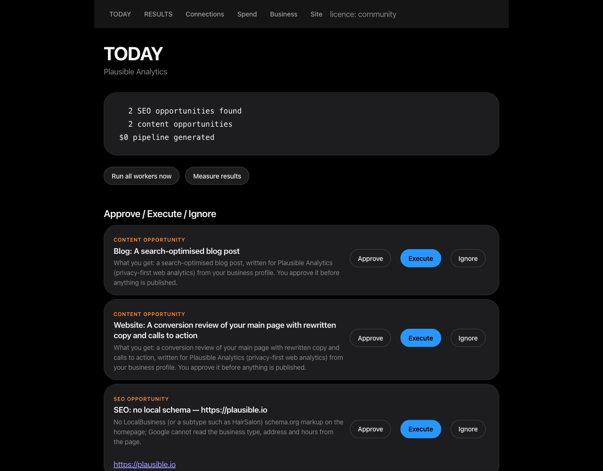

<p align="center">
  
</p>

<h1 align="center">RevenueOS</h1>

<p align="center">
A revenue department for one business. It reads your website, ads, leads and mailbox,
turns what it finds into a short list of actions, does the ones you approve, and measures
what changed.
</p>

<p align="center"><strong>Connect once. Everything runs free. Pay when you agree with the result.</strong></p>

<p align="center">
<a href="https://pypi.org/project/revenueos/"></a>
<a href="https://github.com/unempyd/revenueos/actions/workflows/ci.yml"></a>
<a href="LICENSE"></a>

</p>

<p align="center">
<a href="docs/proof.md">Runtime proof</a> ·
<a href="docs/architecture.md">Architecture</a> ·
<a href="docs/security-and-approval.md">Security &amp; approval</a> ·
<a href="docs/integrations.md">Integrations</a> ·
<a href="docs/community-vs-hosted.md">Community vs Hosted</a> ·
<a href="capabilities/README.md">Capabilities</a>
</p>

---

## What it does

1. **Connect once.** Give it your website. It fills in the rest and labels every guess.
2. **Discover.** It reads the site, the ad exports or ad accounts, the lead lists and the mailbox, and writes what it finds as actions.
3. **Approve.** Nothing changes until you approve an action.
4. **Execute.** It deploys the site fix, pauses the wasting campaign, sends the email, books the call, raises the invoice, publishes the post.
5. **Measure.** It re-reads the live account and records before → after next to the action.
6. **Pay.** Nothing is charged until it has measured a result you agreed with.

## Try it on your site in one command

```bash
uvx revenueos demo https://yoursite.com     # nothing to install; or: pip install revenueos && revenueos demo …
```

No account, and nothing is kept: the demo builds a workspace in a temporary directory and
deletes it before it exits. It is not offline, though. The pages it reads go to whichever
model you have configured, and only `--no-llm` keeps the run entirely local. Here is the
whole output on a neutral domain, verbatim:

```
RevenueOS demo — Example Domain (https://example.com)

  1 pages crawled · ad/analytics tags: none · booking link: no · phones: none seen

  1. MISSING DESCRIPTION — https://example.com
     Page has no meta description.
     → RevenueOS writes the fix as a deliverable you approve, then re-checks the page.
  2. THIN PAGE — https://example.com
     Only ~127 characters of body text were extracted.
     → RevenueOS writes the fix as a deliverable you approve, then re-checks the page.
  3. NO SITEMAP — https://example.com
     No sitemap.xml was discovered at the host root or under the site path.
     → RevenueOS writes the fix as a deliverable you approve, then re-checks the page.
  4. NO CANONICAL — https://example.com
     The homepage declares no canonical URL.
     → RevenueOS deploys this fix itself once the site is connected (git or WordPress), then re-checks it.

  4 finding(s). Everything above runs free, every day, once connected:
     pip install revenueos && revenueos init --from https://example.com && revenueos serve
  You pay only when you agree with a measured result.
```

On a real business the same command also reads the homepage for tappable phone numbers,
LocalBusiness schema, booking links and ad tags (Meta Pixel, Google Ads, GA4).

To run it from CI instead, add one step and read the job summary:

```yaml
- uses: unempyd/revenueos@main
  with:
    url: https://yoursite.com
```

## Connect once

```bash
revenueos init --from https://yoursite.com   # the site fills the questionnaire; every inference is labelled
revenueos serve                              # TODAY / RESULTS / Connections / Spend on http://127.0.0.1:8791
```

A **connection** is an account you authorise once: Stripe, Google (Search Console, GA4,
Calendar, Ads), Meta Ads, a git-hosted site, WordPress. Every connection is read-only until
you turn on **allow changes** for it, and every change still waits for your approval on
TODAY. See [docs/integrations.md](docs/integrations.md).

## How it works

<p align="center">
  
</p>

Four rules hold that picture together, each enforced in code and covered by tests:

- Workers never send, publish or spend. They only write actions.
- Only an approved action reaches an executor, and an executor that changes a connected
  account also needs that connection's **allow changes** switch. It refuses in a plain
  sentence otherwise.
- An outcome is `pending` until there is evidence, `measured` or `no_effect` from evidence,
  and `unmeasurable` with a note saying what would measure it. No metric is ever synthesised.
- A deliverable that was produced but not published is reported as `produced`, never as a win.

The longer version is in [docs/architecture.md](docs/architecture.md).

## What the customer sees

<p align="center"></p>

<p align="center"></p>

The run above and the brief below are from a live run against a real company's public web
presence, read-only, with no email sent to anyone. Nothing in them is mocked.

## Workers

| Worker | Discovers | Executes (after approval) | Measures |
|---|---|---|---|
| `seo` | crawl defects, authority gap, indexing surface | the matching SEO skill, or `site_deploy` when the site is connected | re-crawl: fixed or not |
| `ads-audit` | waste, over-pacing and concentration in ad exports; search terms that spend, convert nothing and are not excluded; then the full control audit (414 controls across 12 platforms, 97 Google and 72 Meta) under the upstream runtime contract, pass or fail only with evidence | the matching ads skill | next export delta; the next search-term read; a failing control re-checked by the next audit |
| `ads-live` | the same on connected Google Ads and Meta accounts, with keywords, quality scores, search terms and negative-keyword lists | `ads_pause`, `ads_budget` | next spend read |
| `analytics` | Search Console queries losing clicks, GA4 channel results | the title and description skill | next Search Console read |
| `billing` | Stripe revenue, MRR, customers, open invoices, paying subscriptions | `send_invoice` | Stripe paid status |
| `discover` | prospects from lead lists or an external prospecting service, through the qualification gate (business email, business website, real company name; reported as found · contactable · qualified) | none | via outreach |
| `outreach` | first-touch drafts from your business canon, re-verified against the live page before sending | sends, under a daily cap, a suppression list and an unsubscribe footer | replies, booked, pipeline value |
| `inbox` | replies, bounces and STOP requests on your mailbox | none | feeds outreach outcomes |
| `intake` | your own documents, dropped into `data/inbox/documents/`: PDF, Word, Excel, PowerPoint, CSV and RTF read entirely on your machine, tables kept as rows; with a model, where a document contradicts or fills a gap in your business canon | records the proposed correction in `learning-loop/CORRECTIONS.md`, which every worker prompt then reads — `company-context/` is never edited by a worker | none directly: a canon correction shows up in the work it changes, and is recorded as `unmeasurable` with that note |
| `content` | content work matched to your channels; a short video brief when one of your channels is a video channel | the deliverable, then `publish_post` to WordPress after a second approval; `render_video` renders the approved brief to MP4/WebM in `data/outputs/` | published 0 → 1 on the live URL; a rendered video is `produced (not published)` |
| `monitor` | Hacker News threads that pass a default-reject relevance gate | none | none |
| `growth` | external adoption numbers for your own surfaces: GitHub traffic, PyPI downloads, site reachability | none | recorded as metrics with a delta |
| `heartbeat` | the state of your objective: what is pending, approved but not run, measured, failed or blocked | none | writes one dated event per run |
| `measure` | none | none | records every outcome above |

`revenueos orchestrator` runs the workers on a schedule (`data/automations.json`).
`revenueos serve` is the same surface as a web panel, with password sessions, onboarding,
the brief and the results ledger.

## What is proven, and what is not

That table says what the code does, which is not the same as what has been watched doing it.
The evidence is uneven, and it is worth knowing which row you are relying on. Dates and
transcripts: [docs/proof.md](docs/proof.md) and [docs/integrations.md](docs/integrations.md).

| Path | Status | Evidence |
|---|---|---|
| Site fix deployed and measured | **run live** | `site_deploy` pushed two commits to the live site; the page carried both tags within 20 s; `canonical_present 0 → 1` and `local_schema_present 0 → 1` (2026-09-13) |
| Content deliverable | **run live** | a real crawl of a real company, one opportunity approved, the skill executed, `deliverable_written 0 → 1` (2026-09-12) |
| Stripe | **read live** | live account: 0 customers, MRR 0.00 AUD, revenue 30 days 0.00 AUD; an invoice draft created and deleted; the same call refused while allow changes was off |
| Google Search Console | **read live** | property verified, then `revenueos run analytics` returned 0 clicks and 0 impressions over 28 days (2026-09-13) |
| Mailbox | **run live** | `inbox` read a live IMAP mailbox; `book_call` sent a real calendar invite. No outreach email has been sent to anyone |
| Hosted, multi-tenant | **run live** | two accounts on one host, each bound to its own workspace; 401 without a login or with a wrong password |
| Google Ads and Meta Ads reads | **not proven live** | every request shape is exercised against mocked endpoints only. Two things gate a live Google Ads run, neither of them code: the `adwords` scope is not requested by default (`revenueos connect google --scopes identity,searchconsole.read,analytics.read,calendar.write,ads.read` asks for it), and a developer token is issued from the API Centre of a Google Ads **manager** account. `ads-live` refuses by naming the missing prerequisite instead of surfacing a 401. `ads-audit` on exported CSVs is a different and simpler path |
| GA4 | **not read** | no GA4 property is configured on the site under test |

**RevenueOS has 0 customers and $0 in revenue.** The rows above are the product doing work
and recording it, not a business result anyone has paid for. Every number RevenueOS reports
is something it observed. Where it cannot observe an effect, it says so instead of
estimating one.

## Approval, permissions and honesty

Workers only look and propose. `execute` on an approved action is the single choke point,
whether it was triggered from the CLI, the panel or MCP. The one path that can mail a
stranger is bounded by a daily send cap, a persistent suppression list, a `List-Unsubscribe`
header, reply-STOP handling and a CASL identification footer. `REVENUEOS_DRY_RUN=1` writes
every send to `data/outputs/` instead of SMTP.

Credentials split in two, and the difference matters:

- **From the environment, never stored.** Model keys, the mailbox passwords
  (`SMTP_PASSWORD`, `IMAP_PASSWORD`), the panel password, the worker token and the connector
  keys are read from the process environment and are never written into the workspace.
- **Stored on disk, because they have to outlive the process.** A connection's secrets are
  written to `data/connections.json` at mode 600: a Stripe secret key, Google and Meta OAuth
  access and refresh tokens, a WordPress application password. They are encrypted at rest
  only when you set `REVENUEOS_TOKEN_KEY`. Without that variable they are plaintext in that
  file, readable by anything that can read it, including a backup or a sync client. Set it,
  or accept that. What bounds the damage is the provider's scopes and the allow-changes
  switch, which is off until you turn it on.

The panel refuses to bind a non-loopback address without a password. There is no telemetry
and no phone-home. Prompts carry a selected slice of your business canon plus the one item
being worked on, never the whole canon or the database. See
[docs/security-and-approval.md](docs/security-and-approval.md) and [SECURITY.md](SECURITY.md).

## Pay when you agree with the result

**Community** is free, MIT-licensed, and is the whole product: every worker, the control
panel, the connections and executors, the capability catalogue (13 packs, 790 skills, 104
agent definitions, 64 connector CLIs), the MCP server and the Claude Code plugin. It is not
a trial, and no clock starts before you have seen a result.

Everything runs free, including continuous operation, until RevenueOS has measured a result
on an action you approved. Then it keeps running free for 14 more days. After that one thing
asks for **Pro** ($99/month): `revenueos orchestrator` running continuously. One-shot runs,
every worker and the panel never lock. A licence key is Ed25519-signed and verified offline;
a missing, expired or unsigned key fails closed to Community.

That licence check is the only thing the software gates. **Business and Agency** ($299 and
$999 per month) are the arrangement under which we run and support RevenueOS for you, not a
larger feature set: multi-brand workspaces, multiple users, CRM sync, centralised analytics,
client fleets, white-label reports and an API do not exist, and nothing in this repository
gates them. Ask before paying for those. Full breakdown:
[docs/community-vs-hosted.md](docs/community-vs-hosted.md).

## Install

```bash
pip install revenueos                        # or: uv tool install revenueos
revenueos init --from https://yoursite.com   # or `revenueos init` for the questionnaire
revenueos run all                            # every worker once
revenueos today                              # the brief
revenueos approve 1 && revenueos execute 1
revenueos run measure && revenueos results
revenueos serve                              # the same surface as a web panel
```

Or run the published image, no Python toolchain needed:

```bash
docker run --rm -v "$PWD/data:/app/data" ghcr.io/unempyd/revenueos:latest revenueos doctor
docker compose pull && docker compose up orchestrator panel   # always-on, panel on 127.0.0.1:8791
```

From source:

```bash
git clone https://github.com/unempyd/revenueos && cd revenueos
uv sync && (cd orchestrator && npm install)
uv run revenueos init
```

Requirements: Python 3.12+, and Node 20+ for the scheduler and the connector CLIs.

An LLM is used if one is present. RevenueOS tries them in order and moves to the next one by
itself when a provider is rate limited, overloaded or unreachable: `ANTHROPIC_API_KEY`, then a
signed-in Claude Code CLI, then any OpenAI-compatible endpoint you point it at with
`REVENUEOS_LLM_BASE_URL` + `REVENUEOS_LLM_MODEL`. `revenueos doctor` shows the order and which
ends are reachable. Without any of them, the deterministic half still runs: the site crawl and its findings, the
ad-export waste, pacing and concentration checks, search-term waste, lead qualification,
inbox replies and bounces, templated outreach drafts, content matching, and all measurement.
Four things do need a model, and say so rather than pretending: executing any action whose
executor runs a skill (the SEO, content and ads deliverables), the 414-control ads audit,
the relevance gate in `monitor`, and the specialist roles. Site deploys, campaign pauses,
invoices, bookings and email sends need no model.

## It keeps working between sessions

RevenueOS holds an **objective** for the business (`revenueos objective add "…"`, the last
onboarding question, or a `MANDATE.md` at the workspace root). A **heartbeat** worker,
scheduled every 30 minutes, reads the state of that objective: what is pending, what was
approved and not run, what was measured, what failed and why, what is blocked and what would
unblock it. It writes one dated event per run, sets the next action, and leaves a message
for you only when a human is needed (`revenueos messages`, or the inbox block on TODAY).
Nothing in it sends, publishes or spends.

Specialist **roles** (`revenueos agent run research|marketing|sales|measurement "<task>"`)
answer one question each with cited evidence, may spawn sub-tasks two levels deep, and can
only propose actions, which land on TODAY like any other. Every measured outcome becomes a
dated **lesson** (`revenueos learn`, `learning-loop/LESSONS.md`) that is injected into later
prompts. All of this works without a model except the roles, which then say so instead of
answering.

## Integrations

Website crawl, Hacker News, ad-platform exports (CSV), lead-list CSVs, SMTP and IMAP
mailboxes, the connections listed above, 64 connector CLIs (analytics, CRM, email, SEO, ads,
enrichment) keyed by environment variables, and an optional external prospecting service.
See [docs/integrations.md](docs/integrations.md).

## Deployment

`Dockerfile`, `docker-compose.yml` (orchestrator, panel, optional TLS proxy) and `deploy/`
(runbook, Fly.io, Railway, smoke test). See [deploy/README.md](deploy/README.md).

## Develop

```bash
uv sync --extra dev --extra mcp && uv run pytest -q     # runs green
(cd orchestrator && npm test && npm run typecheck)
uv run ruff check src tests
```

RevenueOS is an assembly, not a fresh codebase. Most capability is vendored from pinned
upstream repositories, and the code in `src/revenueos/` is the glue: business context,
store, orchestration, approval surface, measurement and billing. Do not edit anything under
`src/revenueos/vendor/`, `skills/`, `agents/` or `tools/`; those are regenerated by
`scripts/vendor.py`. See [CONTRIBUTING.md](CONTRIBUTING.md).

## Privacy

Full policy: **<https://unempyd.github.io/revenueos/privacy.html>**. The short version,
written from what the code does rather than from a template:

**RevenueOS is self-hosted software, not a service.** You run it on your own machine or
server. The RevenueOS project operates no backend, receives no copy of your data and has no
way to reach your workspace. There is no telemetry, no usage reporting, no crash reporting
and no analytics of any kind. Nothing in the product ever calls a RevenueOS-operated host:
licences are HMAC-signed keys verified locally by `billing.py`, so even licensing contacts
no server. (Verified by enumerating every outbound host literal and every network primitive
— `httpx`, `urllib`, `socket`, `smtplib`, `imaplib`, `subprocess` — in the shipped tree,
`src/revenueos/` included, on 2026-09-14.)

**What leaves your machine, and only because you configured it:**

| Destination | When | What is sent |
|---|---|---|
| Your model provider — `api.anthropic.com` (`ANTHROPIC_API_KEY`), the signed-in Claude Code CLI, or an OpenAI-compatible endpoint you set with `REVENUEOS_LLM_BASE_URL` | Any model-backed step | The worker prompt: your `company-context/` canon, recent `learning-loop/CORRECTIONS.md` entries, and the material under analysis — page text, ad-export rows, lead rows, a draft email, text extracted from a document. `REVENUEOS_LLM=off` sends nothing to any model |
| Your own website, and any URL you point a worker at | `init --from`, `demo`, `seo`, `measure` | An ordinary HTTPS GET |
| `hn.algolia.com`, `hacker-news.firebaseio.com` | `monitor` | Your search seeds |
| `api.ahrefs.com` (free domain-rating endpoint) | `seo` | Your domain and your configured competitors' domains |
| `overpass-api.de` and its mirrors, plus the business sites found | `discover` public-data lead sources | A geographic/category query |
| `api.github.com`, `pypistats.org` | `growth` | A public repository / package name |
| Accounts **you** connect: Stripe, Google (Ads, Search Console, Analytics, Calendar), Meta, WordPress, GitHub Pages | Only after `revenueos connect` | API calls to that account, under that provider's own privacy policy |
| Your SMTP / IMAP host | `execute` of an outreach action; `inbox` | The email you approved; a read of your mailbox. Unset `SMTP_PASSWORD` or set `REVENUEOS_DRY_RUN=1` and sends are written to `data/outputs/` instead |
| PyPI | Installation only | The usual package download |

**What is stored, and where — all of it on your disk, none of it anywhere else:**
`company-context/` (the business canon, plain Markdown), `revenueos.yaml` (site,
competitors, channels, sender identity, SMTP/IMAP *host and user* — passwords are read from
the environment, never written to the file), `data/revenueos.db` (SQLite: actions, leads and
their contact details, email drafts and sends, replies, outcomes, metrics, documents),
`data/exports/` (the CSVs you drop), `data/outputs/`, `data/reports/`, `data/documents/`,
`logs/`, and `learning-loop/CORRECTIONS.md`. Credentials for connected accounts live in
`data/connections.json` at mode `0600`, **in plaintext unless you set `REVENUEOS_TOKEN_KEY`**,
which seals them with Fernet. In hosted mode `accounts.json` (also `0600`) holds an email and
a PBKDF2-HMAC-SHA256 password hash at 200,000 rounds.

**Documents you drop into `data/inbox/documents/`** are parsed entirely in-process by
pure-Python libraries (`intake.py`): no upload, no conversion service, no external binary.
The file itself never leaves the machine. Only the *extracted text* is sent to your model
provider, and only when a credential is configured. The intake worker never edits
`company-context/` — it queues a `correction` action for you to approve.

**What you are responsible for as the operator:** you are the data controller. That includes
the lawful basis for contacting the prospects you import, honouring opt-outs (RevenueOS keeps
a suppression list and appends a CASL footer, but the obligation is yours), securing the host
and the workspace directory, setting `REVENUEOS_TOKEN_KEY` if `data/connections.json` matters
to you, and your model provider's own terms for the content you send it.

**Deleting data** means deleting files: remove the workspace directory, or individual files
under `data/`. `revenueos disconnect <provider>` erases that provider's stored tokens. Keep
the `unsubscribes` table — dropping it would let outreach re-contact someone who asked you to
stop.

**The marketing site** (`website/`, published at
<https://unempyd.github.io/revenueos/>) is static: no analytics script, no cookies, no
browser storage, no third-party requests. GitHub Pages serves it and keeps its own logs.

## Licence

RevenueOS is MIT-licensed ([LICENSE](LICENSE)). It includes permissively licensed
open-source components, listed with their licences in [NOTICE.md](NOTICE.md) and reproduced
in `THIRD_PARTY_LICENSES/`. The provenance of every vendored file, down to the upstream
commit, is recorded in [VENDOR.json](VENDOR.json).

<!-- mcp-name: io.github.unempyd/revenueos -->
