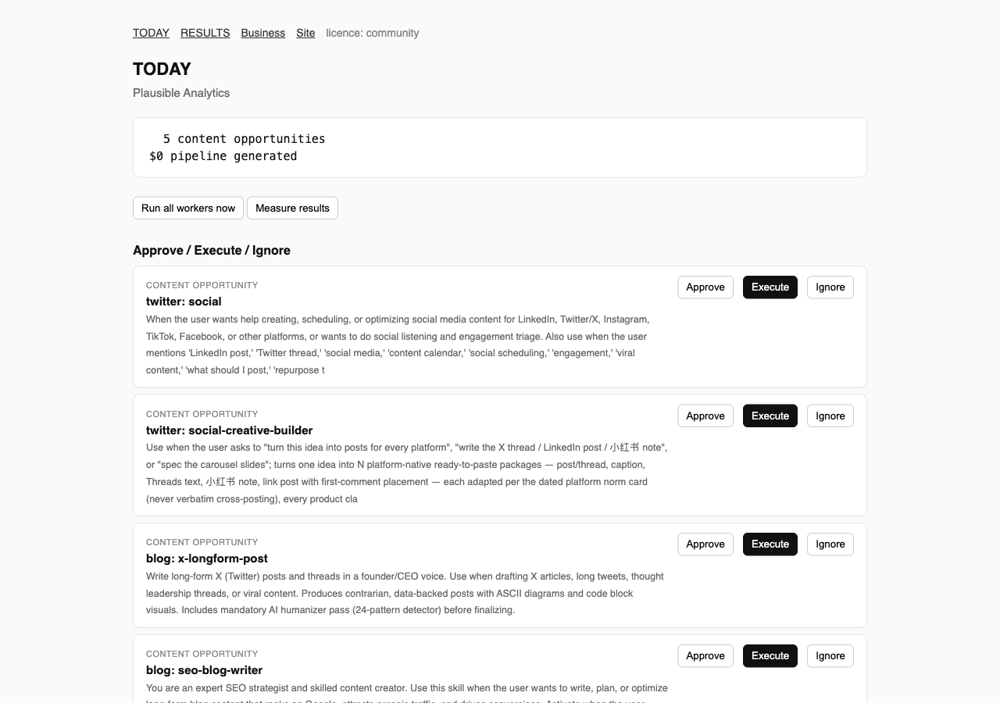
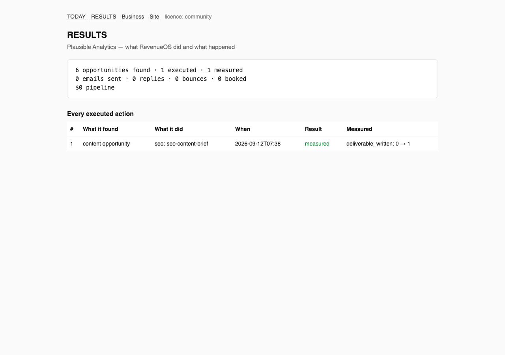

<p align="center"><strong>RevenueOS</strong></p>
<h1 align="center">Connect your business. RevenueOS finds opportunities, executes approved revenue work, and measures what happened.</h1>

<p align="center">
<a href="docs/proof.md">Runtime proof</a> ·
<a href="docs/architecture.md">Architecture</a> ·
<a href="docs/security-and-approval.md">Security &amp; approval model</a> ·
<a href="docs/integrations.md">Integrations</a> ·
<a href="docs/community-vs-hosted.md">Community vs Hosted</a> ·
<a href="capabilities/README.md">Capabilities</a>
</p>

RevenueOS is a self-hosted revenue department for one business. You answer one questionnaire.
Its workers analyse your website, ad exports, lead lists, mailbox and the open web, and turn
what they find into a short list of actions. Nothing sends, publishes or spends until you
approve it. After execution, RevenueOS measures the result and shows it next to the action.

```
Connect → Discover → Approve → Execute → Measure
```

## What the customer sees

<p align="center"></p>

<p align="center"></p>

Both screens come from a real run against a real business (see below); nothing in them is mocked.

## Verified runtime proof

On 2026-09-12 RevenueOS was connected to Plausible Analytics using only its public web
presence (read-only; no email sent), then run end to end:

| Stage | What happened |
|---|---|
| Discover | 12 pages crawled, competitor authority checked, Hacker News searched with a strict relevance gate, 6 content opportunities queued |
| Approve → Execute | one opportunity approved; Claude executed the RevenueOS SEO content-brief skill in 1 m 23 s and produced a 14 KB deliverable |
| Measure | the outcome `deliverable_written 0 → 1` was recorded and shown in RESULTS |

The full transcript, including what it did **not** find and why, is in [docs/proof.md](docs/proof.md).
RevenueOS reports opportunities found, actions executed, execution time and measured outcomes.
It does not claim revenue it has not measured.

## Install

```bash
pip install "git+https://github.com/unempyd/revenueos"   # or: uv tool install git+https://github.com/unempyd/revenueos
revenueos init                       # the questionnaire → your business context
revenueos run all                    # every worker once
revenueos today                      # the brief
revenueos approve 1 && revenueos execute 1
revenueos run measure && revenueos results
revenueos serve                      # the same surface as a web panel on http://127.0.0.1:8791
```

From source:

```bash
git clone https://github.com/unempyd/revenueos && cd revenueos
uv sync && (cd orchestrator && npm install)
uv run revenueos init
```

Requirements: Python 3.12+, Node 20+ (scheduler and connector CLIs). An LLM is optional:
RevenueOS uses `ANTHROPIC_API_KEY` if set, otherwise a signed-in Claude Code CLI; without
either, every worker still runs its deterministic checks.

## Workers

| Worker | Discovers | Executes (after approval) | Measures |
|---|---|---|---|
| `seo` | crawl defects, authority gap, indexing surface | the matching SEO skill | re-crawl: fixed or not |
| `ads-audit` | wasted spend, over-pacing, concentration in ad exports | the matching ads skill | next export delta |
| `discover` | prospects from lead lists or an external prospecting service | — | via outreach |
| `outreach` | first-touch drafts from your canon | sends (daily cap, suppression list, unsubscribe footer) | replies, booked, pipeline value |
| `inbox` | replies, bounces and STOP requests on your mailbox | — | feeds outreach outcomes |
| `content` | content work matched to your channels | Claude produces the deliverable | deliverable written |
| `monitor` | Hacker News threads that pass a strict relevance gate | — | — |
| `measure` | — | — | records every outcome above |

`revenueos orchestrator` runs the workers on a schedule (`data/automations.json`);
`revenueos serve` is the control panel with password sessions, onboarding, the brief and results.

## Community and Hosted

**RevenueOS Community** (free, MIT): the CLI and every worker run manually, the control
panel on localhost, the capability packs (13 packs, 790 skills, 104 agents, 64 connector
CLIs), the MCP server and Claude Code plugin exposing six capabilities: SEO Auditor,
Ads Auditor, Lead Discovery, Sales Follow-up, Marketing Intelligence, Revenue Monitor.

**RevenueOS Hosted** (Pro $99, Business $299, Agency $999 per month): continuous operation,
the panel deployed for you, connectors, approved execution, measurement history and billing.
A signed licence key unlocks continuous operation on self-hosted installs. Details:
[docs/community-vs-hosted.md](docs/community-vs-hosted.md).

## Security and approval

Workers never send, publish or spend. Only an approved Execute does, and it is bounded by a
daily send cap, a suppression list, `List-Unsubscribe` and reply-STOP handling. Credentials
live in the environment, never in the workspace. The panel refuses to bind a public address
without a password. See [docs/security-and-approval.md](docs/security-and-approval.md) and
[SECURITY.md](SECURITY.md).

## Integrations

Website crawl, Hacker News, ad-platform exports (CSV), lead-list CSVs, SMTP/IMAP mailboxes,
64 connector CLIs (analytics, CRM, email, SEO, ads, enrichment) keyed by environment
variables, and an optional external prospecting service. See [docs/integrations.md](docs/integrations.md).

## Deployment

`Dockerfile`, `docker-compose.yml` (orchestrator, panel, optional TLS proxy) and `deploy/`
(runbook, Fly.io, Railway, smoke test). See [deploy/README.md](deploy/README.md).

## Licence

RevenueOS is MIT-licensed. It includes permissively licensed open-source components, listed
with their licences in [NOTICE.md](NOTICE.md) and reproduced in `THIRD_PARTY_LICENSES/`.
Provenance of every included file is recorded in `VENDOR.json`.

<!-- mcp-name: io.github.unempyd/revenueos -->

## Develop

```bash
uv sync --extra dev --extra mcp && uv run pytest -q
(cd orchestrator && npm test && npm run typecheck)
uv run ruff check src tests
```

See [CONTRIBUTING.md](CONTRIBUTING.md).
